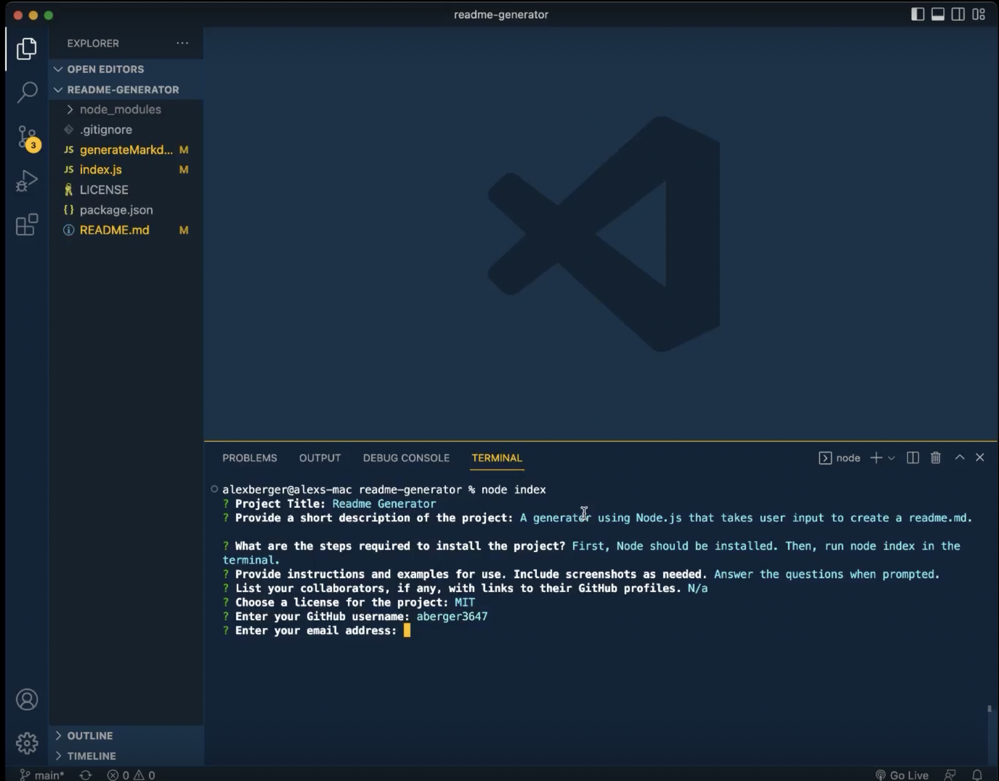

  # Readme Generator

  

  ## Description
  A generator using Node.js that takes user input to create a readme.md.
  
  ## Table of Contents
  - [Installation](#installation)
  - [Usage](#usage)
  - [Screenshot](#screenshot)
  - [Contributing](#contributing)
  - [Tests](#test)
  - [License](#license)
  - [Questions](#questions)
  
 ## Installation
  First, Node should be installed. Then, run node index in the terminal.
  
## Usage
  Answer the questions when prompted.
  [Video Walkthrough](https://drive.google.com/file/d/1d1rFLTcjdidNIY-2xEzCzulQ93rAXr1e/view?usp=sharing)
 
## Screenshot

## Contributing
  N/a

## Tests
  N/a
  
## License
  Learn more about [MIT](https://choosealicense.com/licenses/mit/).
  
## Questions
  GitHub Username: aberger3647

  You can reach me with any questions at aberger3647@gmail.com
